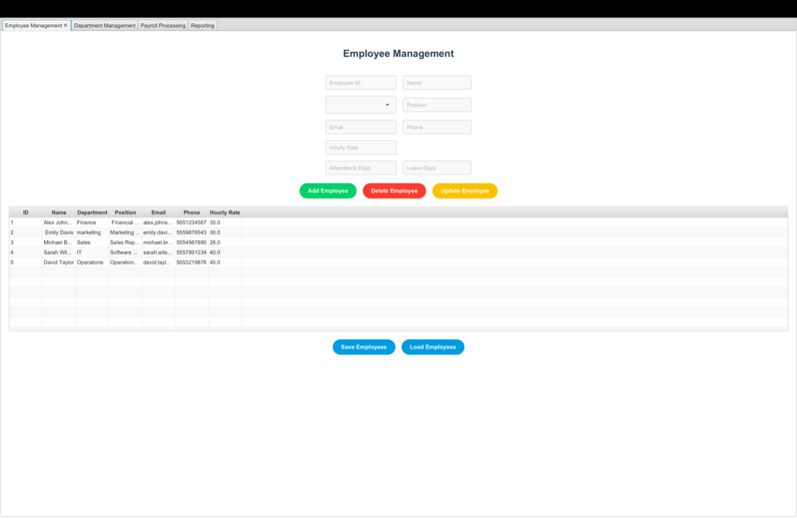
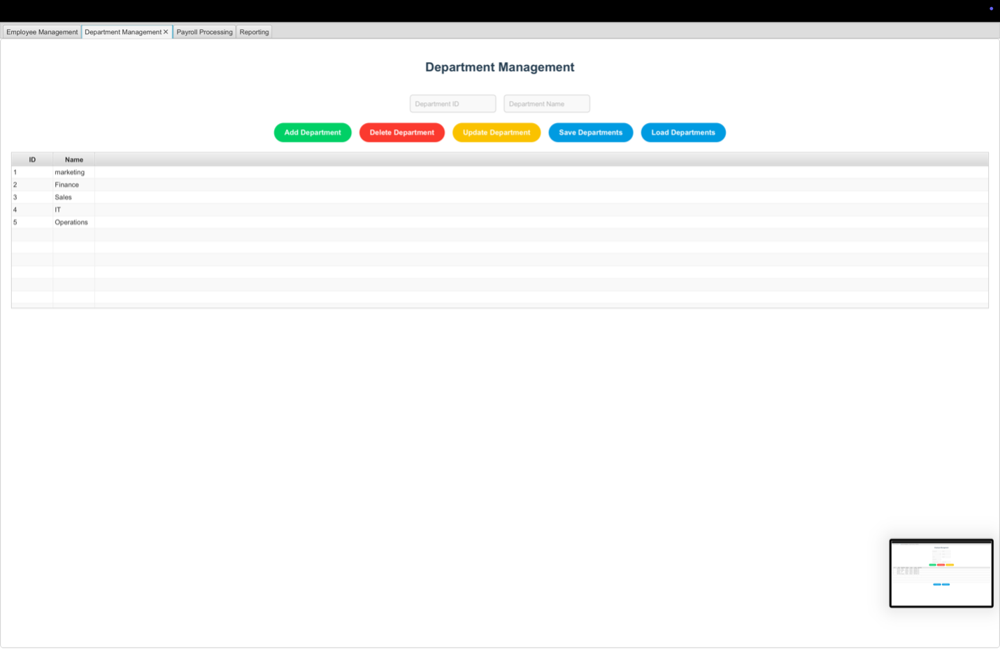
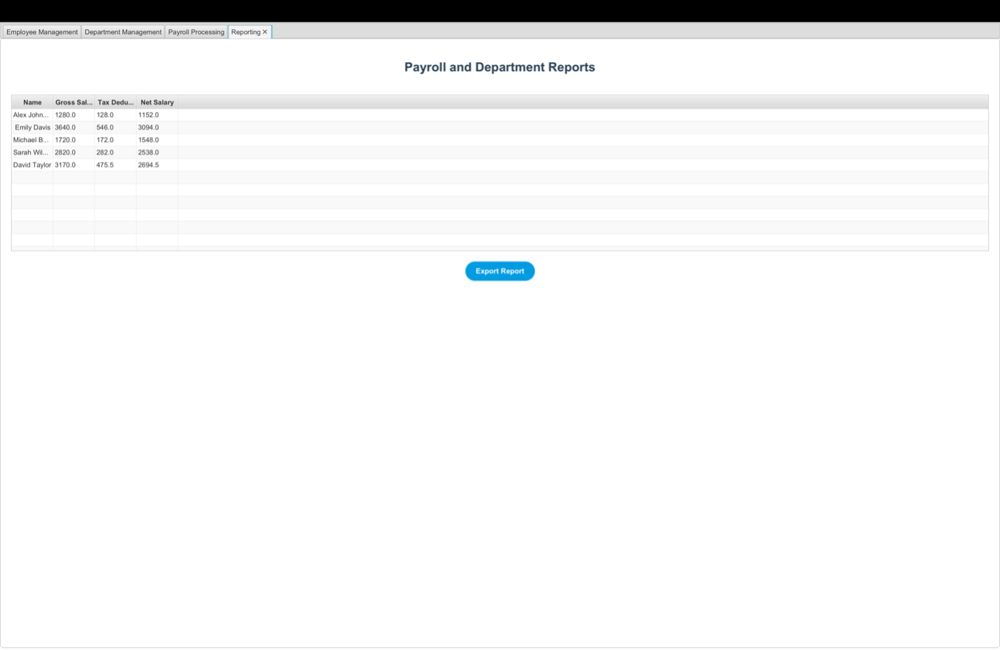

# JavaFX-EmployeeManager
# 🚀 Employee and Department Management System

A JavaFX-based application designed to simplify managing employee records, department data, and payroll information. 📊

## 🎯 Project Overview

This project is a JavaFX-powered desktop application that efficiently manages employees and departments while automating payroll generation. It aims to provide intuitive, user-friendly interfaces and effective data handling mechanisms.

## 🌟 Key Features

- **👤 Employee Management:** Easily add, modify, and delete employee details.
- **🏢 Department Management:** Create, update, and manage departmental information.
- **💰 Payroll Automation:** Generate payroll with accuracy and speed.
- **💾 Persistent Storage:** Utilizes Java serialization to reliably store and retrieve data.
- **📑 CSV Export:** Generate payroll reports for external use.


## 🖥️ Screenshots

### Employee Management Interface


### Department Management Interface


### Payroll Report Example


## 🛠️ Technologies Used
- **Java**
- **JavaFX**
- **IntelliJ IDEA**
- **Serialization**
- **CSV** for reporting

## 🚀 Installation & Usage

Clone the repository:
```bash
git clone https://github.com/yourusername/yourrepository.git
```

Open with IntelliJ IDEA and run the main application.

## 📢 Contributions
Contributions are welcome! Feel free to submit pull requests or open issues for improvements.

## 📜 License
This project is licensed under the MIT License. See [LICENSE](LICENSE) for more details.


This project is licensed under the MIT License - see the LICENSE file for details.

